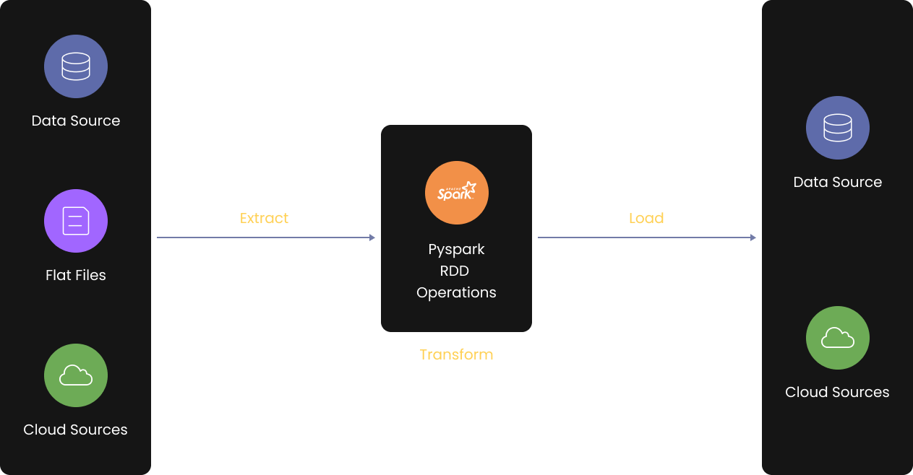

# PySpark Project – Build a Data Pipeline using Hive and Cassandra

## 📌 Project Overview

This project demonstrates how to build an end-to-end **ETL (Extract–Transform–Load) and ELT (Extract–Load–Transform) data pipeline** using **PySpark**, integrated with **Apache Hive** and **Apache Cassandra**, deployed on **AWS EC2** using **Docker**.

The pipeline showcases how distributed data processing frameworks and modern data storage systems can work together to handle large-scale structured and semi-structured data efficiently.

---

## 🚀 What You Will Learn

- End-to-end ETL & ELT pipeline design
- PySpark fundamentals and distributed processing
- Integration of PySpark with:
  - Apache Hive (Data Warehousing)
  - Apache Cassandra (NoSQL Database)
- Differences between ETL and ELT
- Docker containerization using Docker Compose
- Deploying data pipelines on AWS EC2
- Managing big data workflows in a production-like environment

---

## 🧱 Tech Stack

**Language**
- Python

**Big Data & Processing**
- PySpark
- Apache Hive
- Apache Cassandra

**Cloud & DevOps**
- AWS EC2
- Docker
- Docker Compose

---

## 🗂️ Project Architecture




Data Source
↓
PySpark (Extract & Transform)
↓
Apache Hive (Analytical Storage)
↓
Apache Cassandra (Operational Storage)


- **Hive** is used for analytical querying and data warehousing
- **Cassandra** is used for fast, scalable NoSQL data storage
- **PySpark** orchestrates data ingestion, transformation, and loading

---

## 🧪 Project Agenda

This project is part of a PySpark project series:

- Previous project: PySpark integration with Amazon S3 and MySQL
- Current focus:
  - PySpark + Hive
  - PySpark + Cassandra
  - ETL and ELT workflows

---

## ⚙️ Setup & Installation

### 1️⃣ Prerequisites

- Python 3.10+
- Java  8 or 11
- Docker & Docker Compose
- AWS EC2 (Ubuntu / Amazon Linux recommended)

---

### 2️⃣ Clone the Repository

```bash
git clone https://github.com/Chile93/PySpark-Project-Build-a-Data-Pipeline-using-Hive-and-Cassandra.git

cd PySpark-Hive-Cassandra-ETL